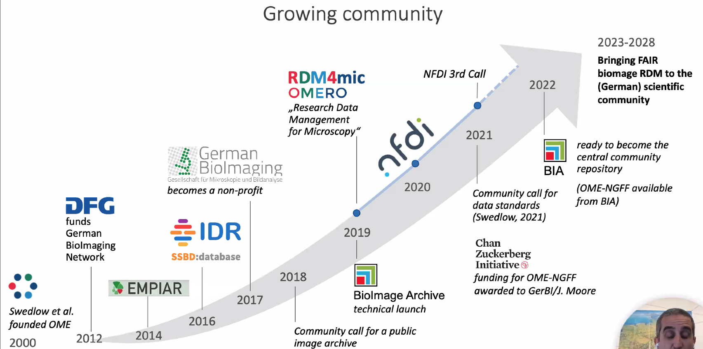

Metadata models:
- RDF
    - https://www.w3.org/TR/rdf11-primer/
    - Book ["Validating RDF"](https://book.validatingrdf.com/) available online for free 
- ISA

[5 Star Open Data](https://5stardata.info/en/)

[Repording and Reproducibility in Microscopy](https://www.nature.com/collections/djiciihhjh)

Current metadata schemas and what they connect to:

Example metadata entries for an image:

Timeline of Omero metadata community development:
